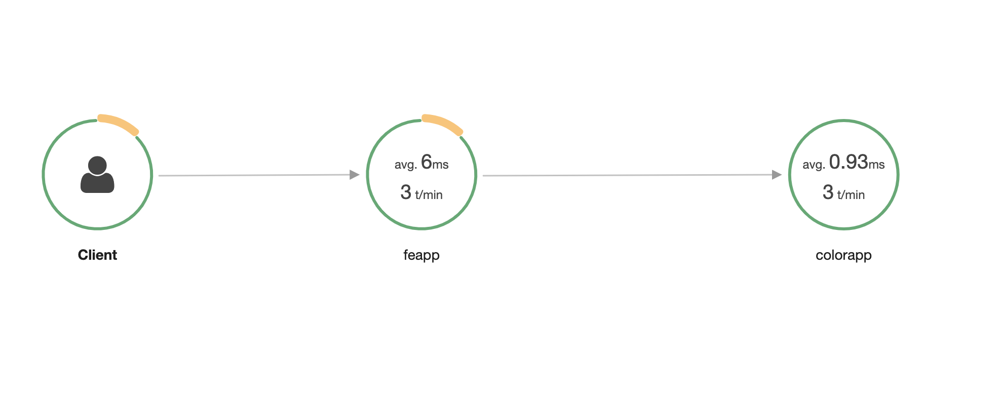

### Deploying the app
Build and push images -
```shell script
cd xray
./build.sh
cd ../feapp
./build.sh
cd ../colorapp
./build.sh
cd ..
```

Deploy x-ray daemonset -
```shell script
kubectl apply -f xray-k8s-daemonset.yaml
````
Deploy application manifests -
```
kubectl apply -f manifest.yaml
```
### Testing the app

Launch a curler in the **xray** namespace created by the manifests -
```shell script
kubectl -n xray run -it curler --image=tutum/curl /bin/bash
```

Call the front app -
```shell script
curl front:8080/color;echo;
> blue
curl front:8080/ping;echo;
> Pong
```
Call the color app directly -
```shell script
curl color:8080/;echo;
> blue
```

### Noteworthy

In manifest.yaml -
```yaml
          env:
            - name: AWS_XRAY_DAEMON_ADDRESS
              value: xray-service.default:2000
```

In xray-k8s-daemonset.yaml
```yaml
    spec:
      hostNetwork: true
      containers:
      - name: xray-daemon
        ports:
        - name: xray-ingest
          hostPort: 2000
```
X-Ray screenshot
